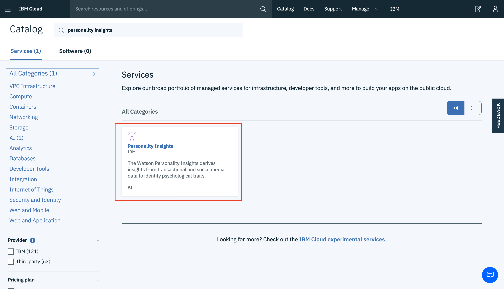
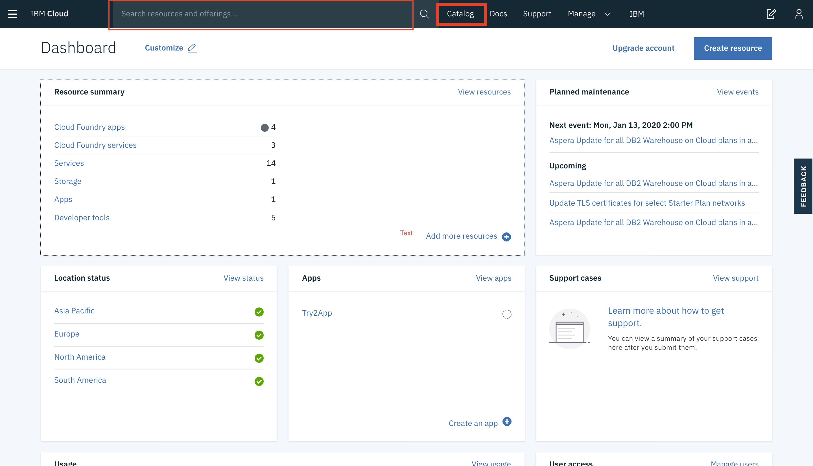
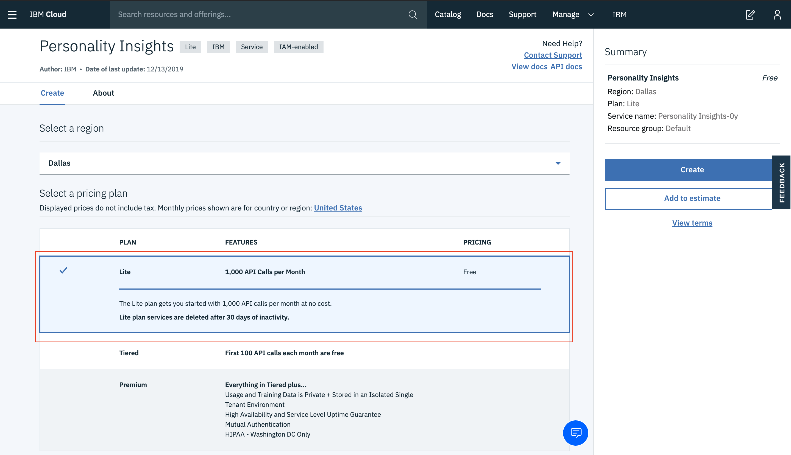
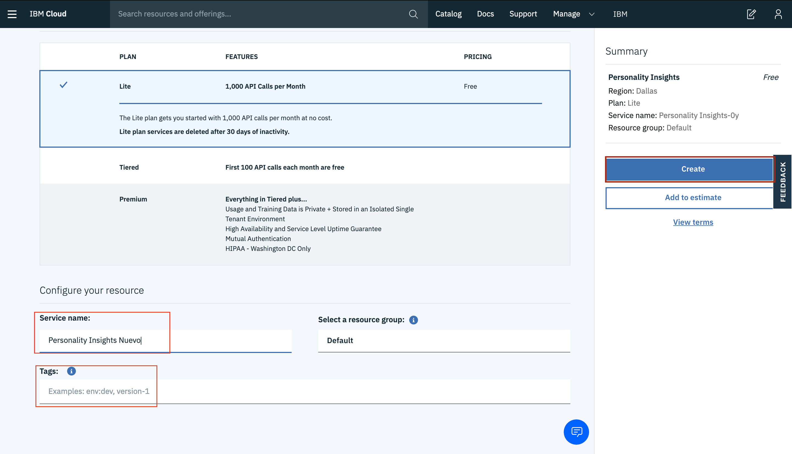
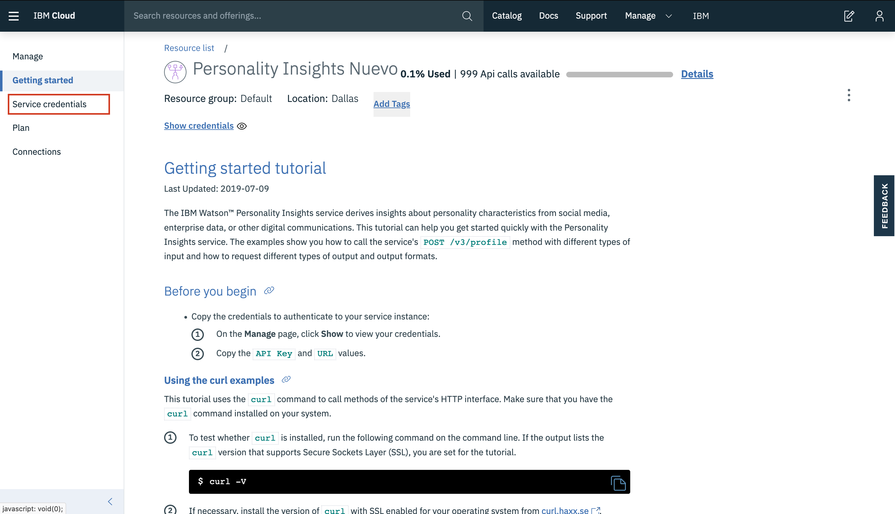
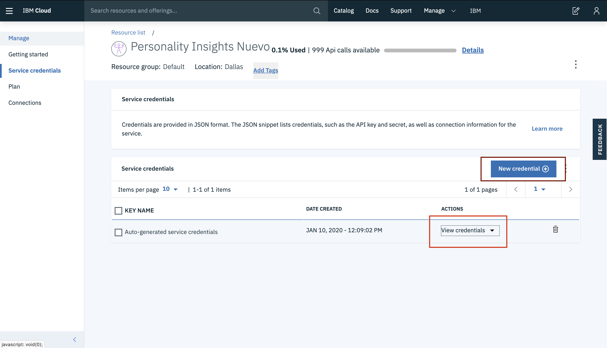
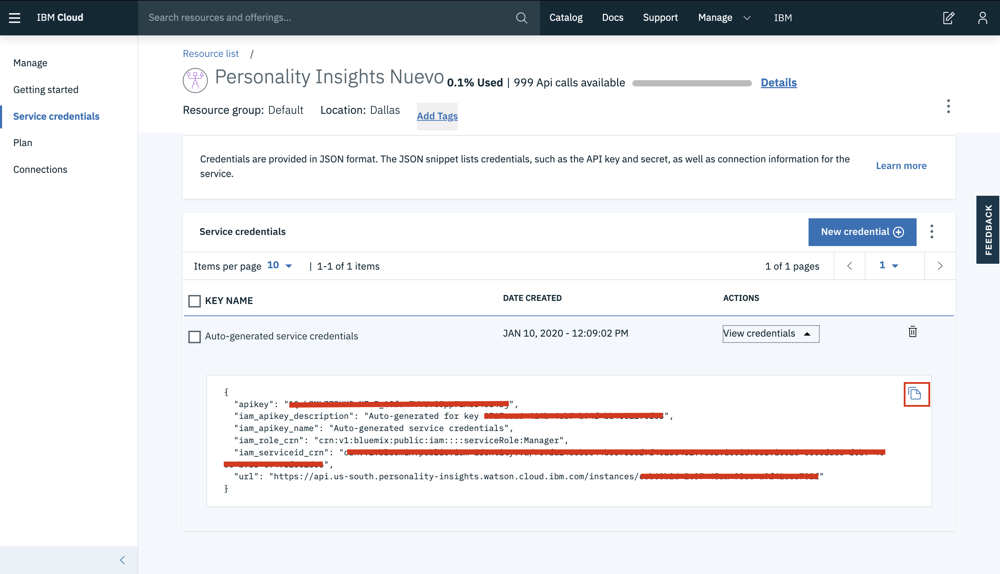

# API Challenge

REST API para procesar texto utilizando el API Personality Insights de IBM y
almacenar el resultado en una tabla de DynamoDB.

## Getting Started

Estas instrucciones le proporcionarán una copia del proyecto en funcionamiento en su máquina local para fines de desarrollo y prueba. Consulte la implementación para obtener notas sobre cómo implementar el proyecto en un sistema en vivo.

### Prerequisites 📋

Para el funcionamiento del proyecto es necesario:

- Tener una cuenta de [IBM Cloud](https://www.ibm.com/cloud/)
- Contar con credenciales(API KEY y SECRET ACCESS KEY) en AWS
- Instalar [NodeJS y NPM](https://nodejs.org/es/download/)
- Instalar [Docker](https://docs.docker.com/engine/install/) y [Docker-compose](https://docs.docker.com/compose/install/)
- Tener credenciales para el servicio Personality Insights. A continuación se explica el proceso.

#### Servicio y credenciales de Personality Insights

Crear nuestro servicio dentro de IBM Cloud. Para esto, iremos a la parte de [catalogo](https://cloud.ibm.com/catalog#services) y buscaremos Personality Insihgts.




Seleccionamos la region mas cercana, la version LITE, lo nombramos, y le agregamos los TAGS necesarios, para finalizar le daremos click en crear.




Ya que estemos dentro de la pagina principal del servicio donde encontraremos más información de como implementarlo, damos click en Service Credentials.



Click en View Credentials para verlas y copiarlas, ya que lo usaremos mas adelante (en caso de que no se haya creado de manera automatica, podemos generar una con New Credential+)




### Installing :arrow_down:

Para usar el proyecto clone el repositorio o descarguelo:

```ssh
git clone https://github.com/alvarez98/api-challenge.git
```

Instalar librerias

```
sudo npm i
```

## Deployment 📦

Agregar las variables necesarias en un archivo .env, basado en la plantilla **.env.example**

```
PORT=
APIKEY=
URL_IBM=
AWS_ACCESS_KEY_ID=
AWS_SECRET_ACCESS_KEY=
```

Iniciar contenedor de DynamoDB

```
docker-compose up -d
```

Crear tabla Profile

```
npm run create-table-profile
```

Iniciar servidor

```bash
node server.js 
```
## Built With :hammer_and_wrench:

- [NodeJs](https://nodejs.org/es/)
  - [Express Framework](https://expressjs.com/es/)

## Versioning :triangular_flag_on_post:

- [1.0.0](https://github.com/alvarez98/api-challenge/tree/1.0.0)
- [1.2.0](https://github.com/alvarez98/api-challenge/tree/1.2.0)
- [1.2.1](https://github.com/alvarez98/api-challenge/tree/1.2.1)

## Future work 🚀

## Contributors :family_man_man_boy:

- **Esteban Alvarez** - _Initial work_ - [@alvarez98](https://github.com/alvarez98)

## Credits :star:

- **A template to make good README.md** - _Base template_ - [PurpleBooth](https://gist.github.com/PurpleBooth/109311bb0361f32d87a2)
- **Proceso para obtener el servicio y credenciales de Personality Insights de IBM** - [Isaac Carrada](https://github.com/elbuenizzy/PersonalityInsights)

## Referencias :link:

1. [IBM CLOUD](https://cloud.ibm.com/apidocs/personality-insights?code=node#introduction)
2. [AWS DynamoDB](https://docs.aws.amazon.com/es_es/amazondynamodb/latest/developerguide/GettingStarted.NodeJs.html)
## License 📄

This project is licensed under the MIT License - see the [LICENSE](LICENSE) file for details

Made with ❤️ by [Esteban Alvarez](https://github.com/alvarez98) 